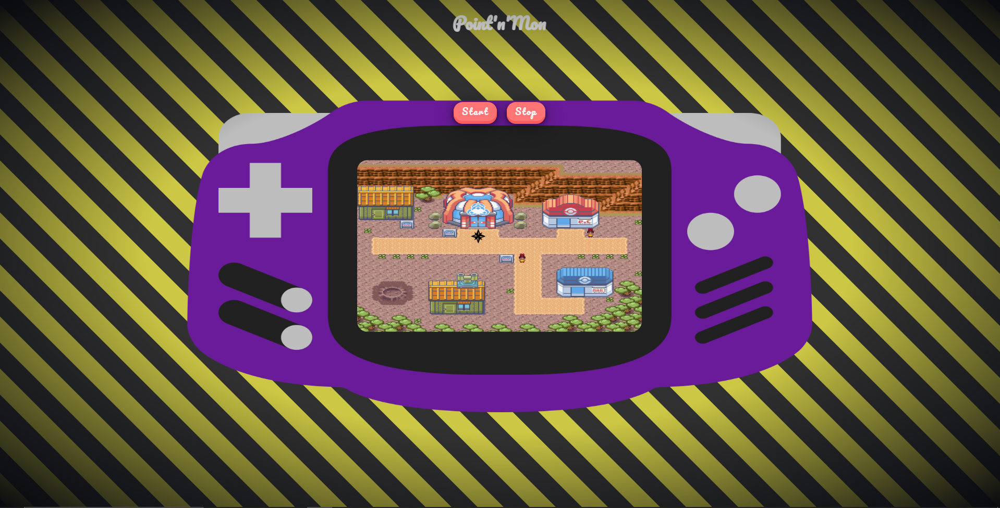

# Point-n-mon, un projet pour découvrir et apprendre les bases du web



## Mes intentions avec ce projet

- Faire découvrir le développement web
- Le rendre accessible au plus grand nombre
- Avoir un environnement ludique

## Caractéristique du projet

- Durée : 1 jour
- Niveau : Élève de 3ème / Toute personnes sans base web
- Encadrement : 
  - 1h de discussion avec l'élève, Ice Breaking
  - 2h d'aide entre des exercices simple pour appréhander l'html et le projet final Point'N'Mon

## Contenu du projet

Ce projet se décompose en 2 parties : 

- Partie théorique : Cours sur le web
- Partie pratique : Développement de Point'N'Mon

⚠️ Correction de la partie pratique ⚠️
Pour faciliter le partage du projet entre encadrant et élève, 2 branches sont à disposition. Il suffit donc de cloner la bonne branche et de le faire aussi pour l'élève. 

- La branche **main** (celle-ci), **AVEC** la correction. 
- La branche **exo**, **SANS** la correction.

### Architecture du projet

```js
┐
├ cours
│ ├ pages
│ │ ├ tuto.html    // Les cours théoriques
│ │ └ project.html // Les consignes pour le projet Point'N'Mon 
│ └ index.html     // La page d'accueil presentant le web et le déroulement de la journée
│
└ project       // Le projet Point'N'Mon avec le code
  ├ assets      // Différents assets pour le projet
  ├ js          // L'ensemble des scripts js qui ne sont pas à modifier par l'élève
  ├ styles      // L'ensemble des styles css qui ne sont pas à modifier par l'élève
  ├ styles.css  // Le fichier à modifier pour réaliser le projet sur la partie css    
  ├ index.js    // Le fichier à modifier pour réaliser le projet sur la partie js
  └ index.html  // Le fichier à modifier pour réaliser le projet sur la partie html
```

### Partie théorique

Cette dernière se situe dans la page **tuto.html**. Elle regroupe un ensemble de ressources réparti entre : 

- Des cours et exercices issues de [tech.io](https://tech.io) pour découvrir l'html, le css et le js.
- Des liens vers de la [documentation MDN](https://developer.mozilla.org/fr/docs/Web) pour apprendre à lire une documentation.

### Partie pratique

Cette dernière est découpée en 6 petits exercices à réaliser pour implémenter l'ensemble des fonctionnalités de Point'N'Mon. Ces exercices amenerons à l'écriture de :

- 2 fonctions javascript
- 5 boutons html
- 2/3 classes css

⚠️ **La solution à tous les exercices est disponible sur la branche main à l'emplacement de l'exercice.** ⚠️

L'implémentation de ces fonctionnalités est amenée à l'aide de l'histoire suivante :

- Pour jouer, démarrons la console.
- Plaçons Sacha pour dialoguer avec lui.
- Plaçons un adversaire pour lancer un combat de pokémon.
- Réparer l'interface de combat.
- Changer de carte afin de voir de nouvelle contré.
- Pour finir, éteindre la console pour finir la partie.

## Exemple de déroulement de la journée

Matinée

<table>
  <tbody>
    <tr>
      <th align="center">9h</th>
      <th align="center">9h -> 10h30</th>
      <th align="center">10h30 -> 12h</th>
    </tr>
    <tr>
      <td>Début de journée</td>
      <td>
        Ice breaking, Dialogue avec l'élève ou l'on peut : 
        <ul>
          <li> 
            Se présenter ainsi que son cursus. Cela permet à l'élève de :
            <ul>
              <li>Savoir ce qu'il souhaite / pourrait faire</li>
              <li>Cerner avec qui il va passer une super journée</li>
              <li>Et nous apprendre qui il est et ce qui le passionne</li>
            </ul>
          </li>
          <li>
            Présenter les différents domaines de l'informatique comme le web, l'applicatif, le hardware, ...
            <ul>
              <li>Partager des connaissances sur l'informatique</li>
              <li>Partager sa passion pour l'informatique</li>
              <li>Intéressé l'élève</li>
            </ul>
          </li>
        </ul>
      </td>
      <td>
        Monté en compétences en autonomie :
        <ul>
          <li>Appréhender les différentes technologies du web</li>
          <li>Retenir comment construire un petit site web</li>
        </ul>
      </td>
    </tr>
  </tbody>
</table>

Après-Midi

<table>
  <tbody>
    <tr>
      <th align="center">14h -> 15h</th>
      <th align="center">15h -> 17h</th>
      <th align="center">17h</th>
    </tr>
    <tr>
      <td>Fin de monté en compétences</td>
      <td>
        Réalisation d'un projet fun :
        <ul>
          <li>Appliquer les nouvelles compétences</li>
          <li>Avoir un côté ludique au développement</li>
          <li>Maintenir l'attention de l'élève</li>
        </ul>
      </td>
      <td>Fin de journée</td>
    </tr>
  </tbody>
</table>
